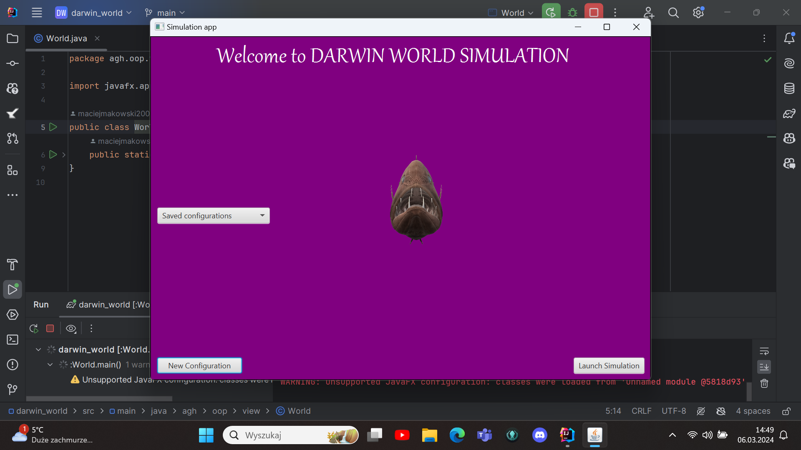
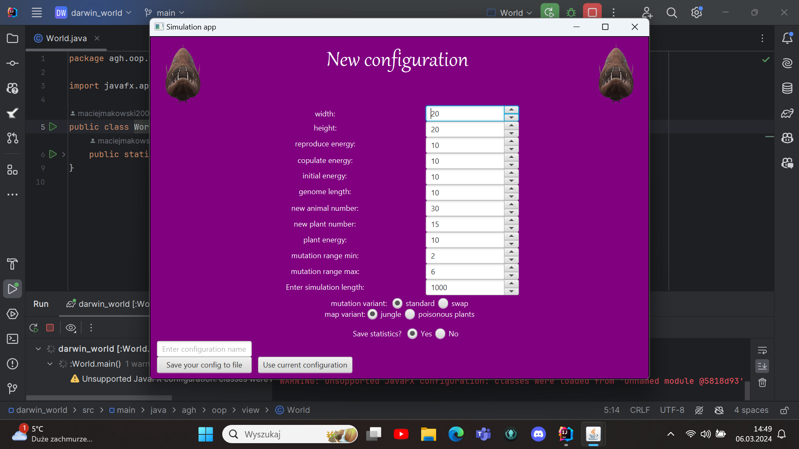
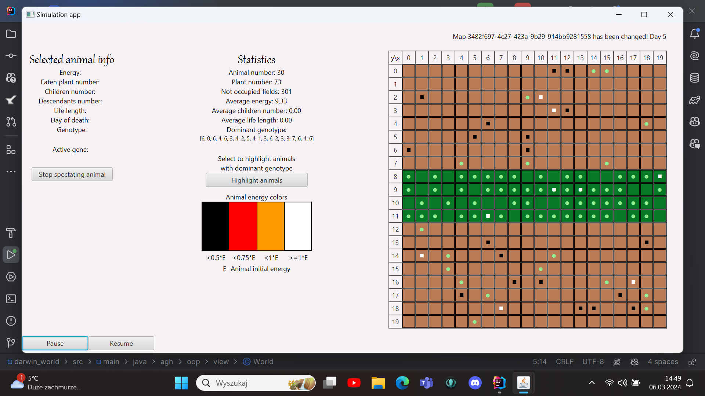
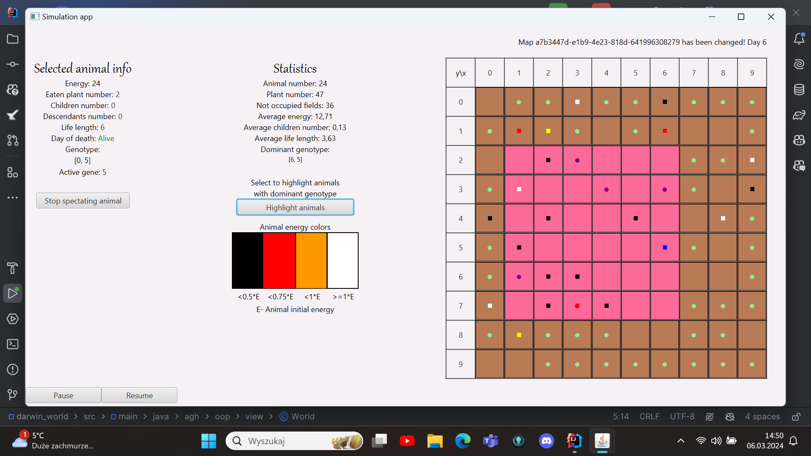

# OOP Project: Darwin World

The following content has been adapted by Aleksander Smywiński-Pohl based on the description and illustrations prepared by Wojciech Kosior. His inspiration came from the book "Land of Lisp" by Conrad Barski, who, in turn, was inspired by an article in "Scientific American." Finally, Radosław Łazarz introduced modifications, partly based on the book "Genetic Algorithms and Their Applications" by David E. Goldberg. Quite a few people contributed to this small project.:)

## Project goal

Let's create a game! However, it won't be a game that we play. Instead, it will be a world that evolves before our eyes! We'll build an environment of steppes and jungles with animals that run, forage in the bushes, eat, and reproduce. After a few million years, we'll see them evolve into different species!

The world of our game is quite simple. It consists of a regular, rectangular surface divided into square fields. Most of the area is covered by steppes, where only a few plants grow, serving as the food source for animals. However, some regions are covered by jungles where plants grow much faster. Plants will sprout in random locations, but their concentration will be higher in the jungle than in the steppe.

Our herbivorous animals will traverse this world in search of food. Each animal has a specific energy level that decreases every day. Finding and consuming a plant increases the energy level by a certain value.

## Animal anatomy

We need to track several traits of each animal. Firstly, in the case of both plants and those that consume them, we need to know the x and y coordinates. These indicate where a particular animal or plant is on the map.

We also need to know how much energy a given animal has. Since this is a Darwinian survival game, if an animal fails to acquire a sufficient amount of food, it will starve and die. The energy level tells us how many days of functioning remain for a given animal. It must find more food before its energy supply is depleted.

We also need to remember which direction the animal is facing. This is important because each day it will move on the map in that particular direction. There are eight different possible positions and an equal number of possible turns. A turn of 0 means the animal does not change its orientation, a turn of 1 means the animal rotates by 45°, 2 by 90°, and so on. For example, if the animal was facing north and the turn is 1, the animal is now facing northeast.

Finally, we also need to store the genes of the animal. Each animal has N genes, each being a number ranging from 0 to 7. These genes describe (in a very simplified manner) the behavioral pattern of the creature. The existence of our animals has a cyclical nature. Each of them stores information about which part of its genome it will use the next day. During each movement, the animal first changes its orientation according to the currently active gene, then moves one field in the specified direction. The gene is then deactivated, and the gene to its right becomes active (it will control the animal the next day). When genes run out, activation returns to the beginning of their list. For example, the genome: 0 0 7 0 4 means that the creature will sequentially move forward, move forward, slightly turn left, move forward, turn around, move forward, ... - and so on.

## Consuption and reproduction

Eating is a straightforward process. We assume that an animal consumes a plant when it stands on its field, and its energy increases by a predefined value.

Reproduction is usually the most interesting part of any simulation involving animals. Only a healthy pair of parents can have a healthy offspring, so our animals will reproduce only if they have a sufficient amount of energy. During reproduction, parents lose a certain portion of their energy in favor of their offspring - this energy simultaneously serves as the starting energy for their offspring.

The born animal receives a genotype that is a crossbreed of the parents' genotypes. The share of genes is proportional to the energy of the parents and determines the splitting point of the genotype. For example, if one parent has 50 and the other has 150 energy points, the child will receive 25% of the genes from the first parent and 75% from the second parent. This share determines the crossover point of the genotype, assuming that the genes are ordered. In the first step, the side of the genotype from which a part of the stronger individual will be taken is randomly chosen, for example, right. In this case, the child would receive a segment encompassing 25% of the left genes from the first parent and 75% of the right genes from the second parent. However, if the left side were randomly chosen, the child would receive 75% of the left genes from the stronger individual and 25% of the right genes. Finally, mutations occur: a random number (also chosen randomly) of the offspring's genes change their values to completely new ones.

## Simulation

Symulacja każdego dnia składa się z poniższej sekwencji kroków:

The simulation of each day consists of the following sequence of steps:

1. Removal of dead animals from the map.
2. Turning and moving each animal.
3. Consumption of plants by animals that have entered their fields.
4. Reproduction of well-fed animals located on the same field.
5. Growth of new plants on selected fields of the map.

A simulation is described by a set of parameters:

* the height and width of the map,
* the map variant (explained in the section below),
* the initial number of plants,
* the energy provided by consuming one plant,
* the number of plants growing each day,
* the plant growth variant (explained in the section below),
* the initial number of animals,
* the initial energy of animals,
* the energy required to consider an animal well-fed (and ready for reproduction),
* the energy of parents consumed to create offspring,
* the minimum and maximum number of mutations in offspring (can be equal to 0),
* the mutation variant (explained in the section below),
* the length of the animals' genome,
* the behavior variant of animals (explained in the section below).

## Configuration variants

Certain aspects of the simulation are configurable and can significantly alter its course. Some of them are simple numerical parameters (e.g., initial population sizes). However, others can notably modify the simulation rules. This applies especially to the operation of the map, plant growth, mutations, and animal behaviors. Each project team should implement all the aspects from the section below marked as mandatory and additionally choose 2 variants assigned during the first classes by the instructor. One of the additional variants will concern the map (its shape or vegetation), and the other will involve animals (their behaviors or mutations during reproduction).

### Map and plants

*  **Earth** - The left and right edges of the map wrap around. If an animal goes beyond the left edge, it will reappear on the right side, and if it goes beyond the right edge, it will reappear on the left. The upper and lower edges of the map represent poles, and animals cannot enter there. If an animal tries to exit beyond these edges, it remains on the same field, and its direction is reversed.

In the case of plant growth, certain fields are strongly preferred, following the Pareto principle. There is an 80% chance that a new plant will grow in a preferred field, and only a 20% chance that it will grow in a second-category field. Approximately 20% of all locations on the map are considered preferred, while 80% of the locations are deemed unattractive. We implemented the following variants

* [Standard] **Forested equator** - Plants prefer a horizontal strip of fields in the central part of the map (mimicking the equator and its surroundings).
* [F] **Poisoned fruits** - A uniform distribution is preferred, but on a certain square subregion of the map (occupying 20% of the map), toxic plants sometimes appear. Instead of providing energy, these plants deplete it upon consumption. If an animal is supposed to move onto a toxic plant during its movement, it undergoes a perception test - there is a 20% chance of ultimately making a move to another adjacent field and avoiding poisoning (the test can be performed once per day in the animal's life).

### Animals

W przypadku mutacji mamy do czynienia z dwoma prostymi opcjami:

* [Standard] **Complete randomness** - Mutation changes a gene to any other random gene.
* [2] **Swap** - Mutation may also result in swapping the positions of two genes.

Similarly straightforward are the variants of behavior:

* [Standard] **Complete predestination** - the animal always executes its genes sequentially, one after another.

## Statistics and highlighting

The program allow tracking the following statistics for the current situation in the simulation:

1. The number of all animals.
2. The number of all plants.
3. The number of free fields.
4. The most popular genotypes.
5. The average energy level for living animals.
6. The average lifespan of animals for deceased animals (the value includes all deceased animals from the beginning of the simulation).
7. The average number of offspring for living animals (the value includes all offspring, not just those born in a particular epoch).

After stopping the program, it is possible to mark one animal as selected for tracking. From that moment (until tracking is stopped), the UI should provide information about its status and history:

1. Its genome.
2. Which part of its genome is currently active.
3. How much energy it has.
4. How many plants it has consumed.
5. How many offspring it has.
6. How many descendants it has (not necessarily directly its children).
7. How many days it has been alive (if still alive).
8. On which day it died (if its life has already ended).

After stopping the program, it is also possible to:

* Show which animals have the dominant (most popular) genotype (highlighting them).

* Show which fields are preferred by plants (highlighting them).

It is possible to save simulation statistics to .csv file

## Configurations 

1. Selecting one of the pre-prepared configurations.
2. Create and select new configuration.
3. Saving a new configuration for future use.

## Instructions 

- **HomePage**
    - ***New configuration*** - manually set a new configuration with the option to save it to a file.
   - ***Saved configurations*** - load a previously saved configuration from a file.
   - ***Launch Simulation*** - start the simulation with the newly selected configuration or one previously saved (can be launched multiple times).
- **Configuration**
    - There are limitations on the entered data, and there is an option to choose whether to save simulation statistics to a file.
- **Simulation**
    - ***Pause, Resume*** - Pausing and resuming the simulation
    - When the simulation is paused, it is possible to click on any animal to track it - it will be highlighted in ***blue***.
   - When the simulation is paused, there is an option to highlight all animals with the dominant genotype - they will be highlighted in ***yellow***.

## Preview

## Technologies
- Frontend: JavaFX
- Backend: Java

## Installing
...

## Authors
- Maciej Makowski
- Mateusz Król 

## Source of the project outline
https://github.com/Soamid/obiektowe-lab/blob/master/proj/Readme.md 